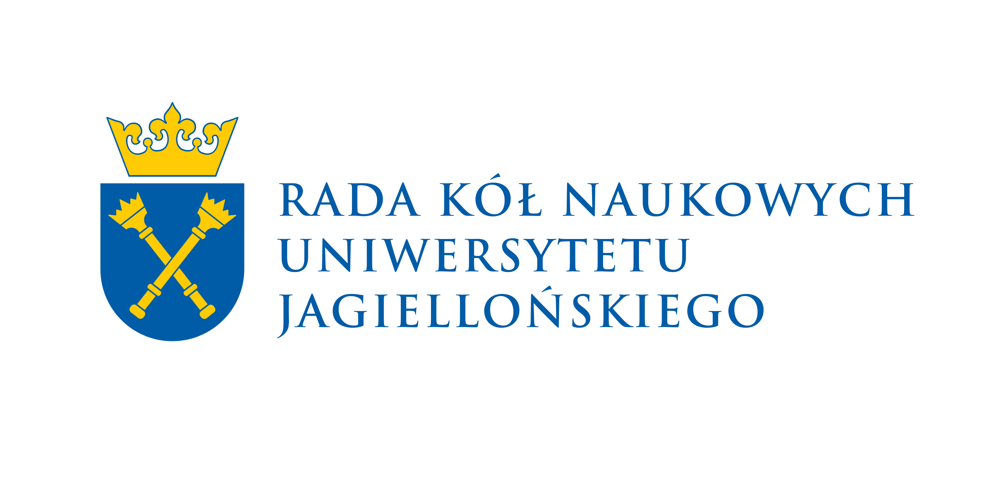
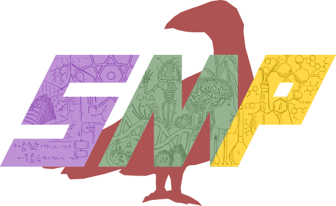
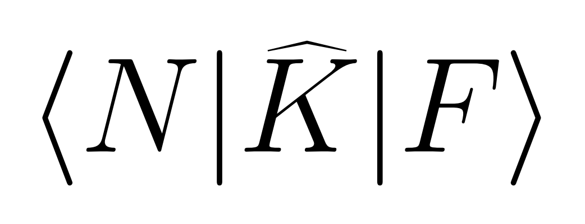

# Warsztaty LaTeXa 2025

**12-13 grudnia 2025**

## Program

Rejestracja: gdzieś na parterze

Warsztaty: aula A-1-13 (piątek) &  (sobota)

### Piątek, 5 grudnia

Wprowadzenie + podstawy 16:15-17:30

Tryb matematyczny 17:40-19:10

Bibliografia 19:20-20:00

Grafika 20:10-20:50

### Sobota, 6 grudnia :santa:

Obwody elektryczne 10:30-11:20

Tryb chemiczny 11:30-12:30

Prezentacje 12:40-13:40

Pizza 13:40-14:20

Tabele 14:30-15:10

Tikz (rysunki i kaczki) 15:20-16:50

## Partnerzy

 

Wydarzenie współfinansowane przez Radę Kół Naukowych Uniwersytetu Jagiellońskiego

 

Wydarzenie współorganizowane przez Koło Matematyczno-Przyrodnicze Studentów Uniwersytetu Jagiellońskiego

Wydarzenie współorganizowane przez Naukowe Koło Fizyczne Studentów Uniwersytetu Jagiellońskiego
